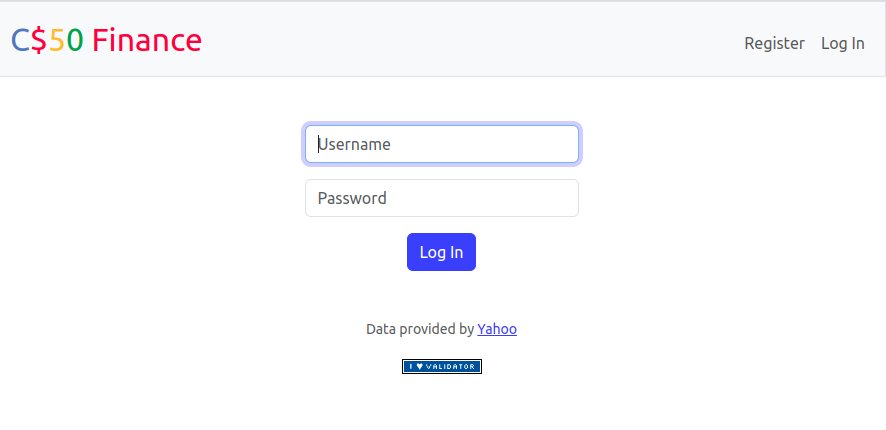
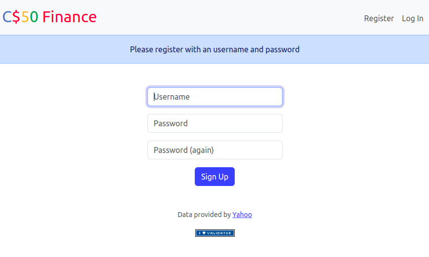
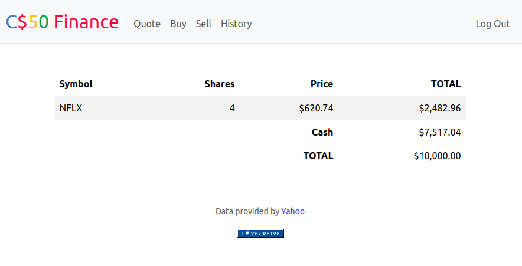
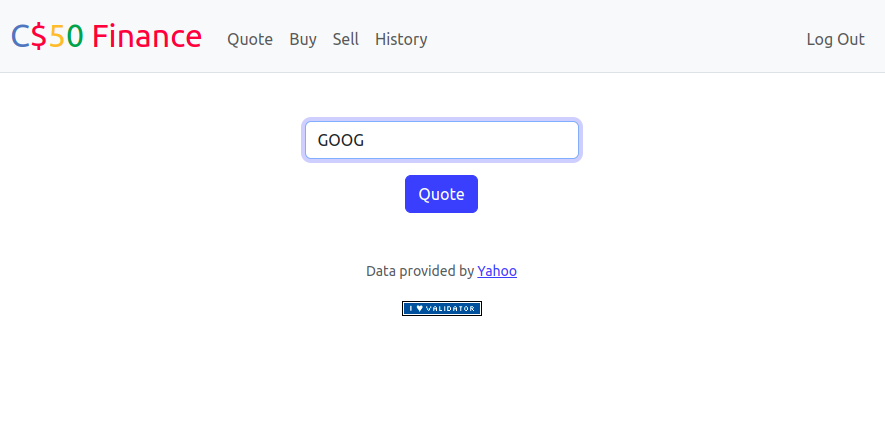
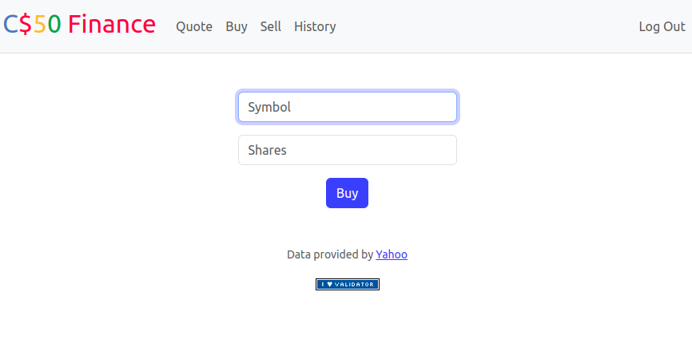
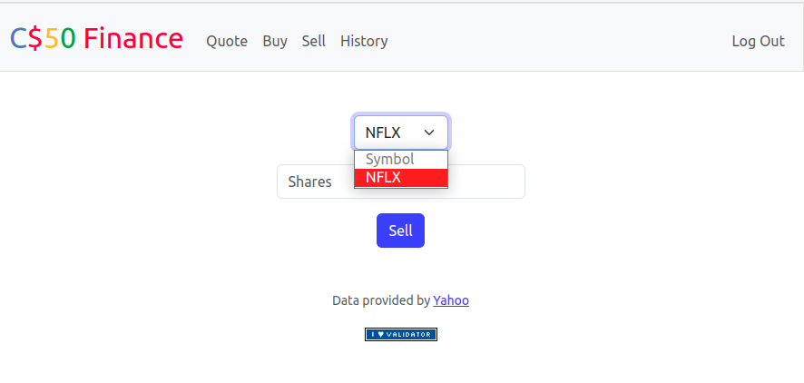
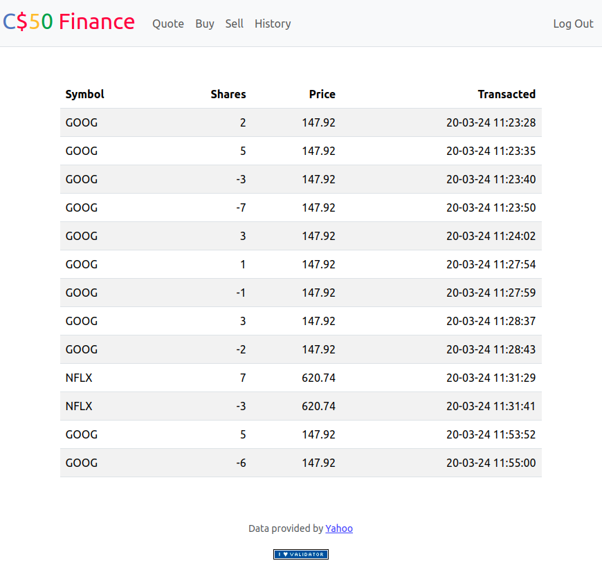
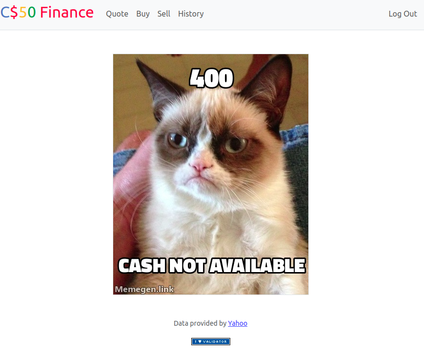

# Finance web page simulator for CS50 course

This is a project work done for the CS50 course at Harvard University. Reference link: [https://finance.cs50.net](https://finance.cs50.net/)

# **Description**

It is a web page designed to act as a stock market buying and selling simulator. It allows users to query a database for available stocks as of March 20, 2023. Additionally, it enables users to create accounts with passwords and an initial cash balance of $10,000. Users can buy and sell stocks and analyze transaction history.

*Note*: It is worth noting that it is possible to modify the page to make it real-time by simply requiring an API key.

## **Web page workflow:**

- Before Login
    - Contains a [login](images/fig1.png) and [register](images/fig2.png) page where passwords are encrypted using the "werkzeug.security" Python library.
- After Login:
    - [Index page](images/fig3.png): Displays a table containing the stocks, the quantity of shares purchased, the unit price of each share, and the total amount.
    - [Quote page](images/fig4.png): Allows users to query a stock with its corresponding symbol and retrieve its price.
    - [Buy page](images/fig5.png): Enables users to purchase a certain stock by entering the symbol and the quantity of shares.
    - [Sell page](images/fig6.png): Allows users to sell any acquired stocks and specify the quantity of shares.
    - [History page](images/fig7.png): Provides information on the number of transactions made, with the share value being either positive or negative to identify it as a purchase or sale.
- [Error page](images/fig8.png):
    - For cases where errors occur, the page displays an image with information about the error code and its description, including:
        - Inadequate amount
        - Empty form fields
        - Cases where users manipulate HTML and data is not in the correct format
        - Stock not found
        - And others.
# Execution
## Requirements
- There is a `requirements.txt` file

`$pip3 install -r requirements.txt` 

## Running
- The project was made on Flask framework. To run the code type:

`$flask run`

# **Images**

Figure 1. Login page

Figure 2. Register page

Figure 3. Index page

Figure 4. Quote page

Figure 5. Buy page

Figure 6. Sell page

Figure 7. History page

Figure 8. Error customize page
